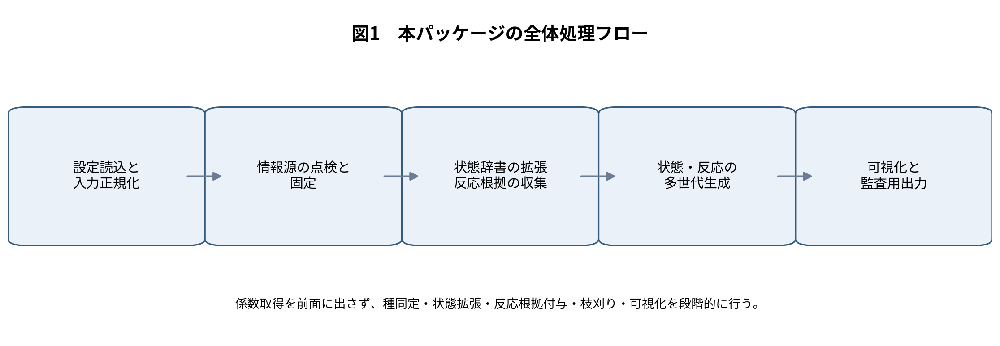
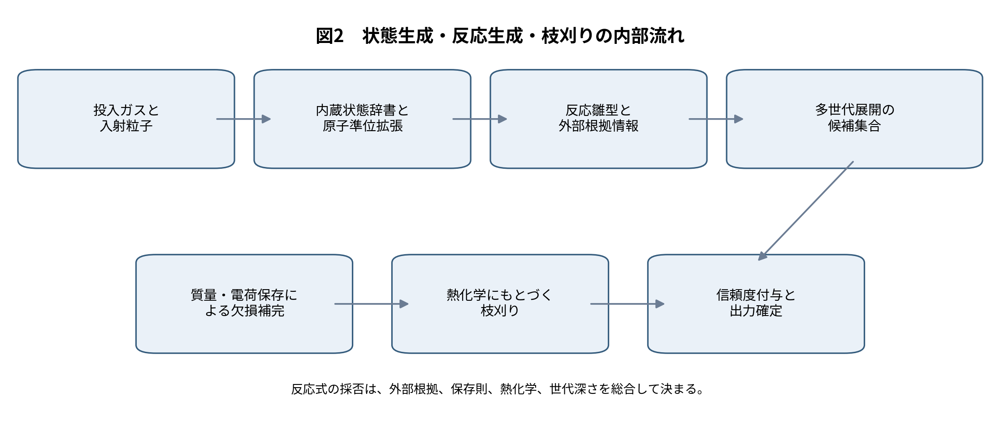
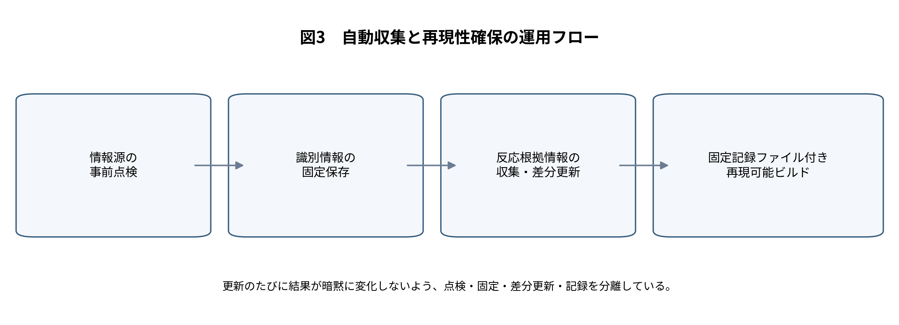
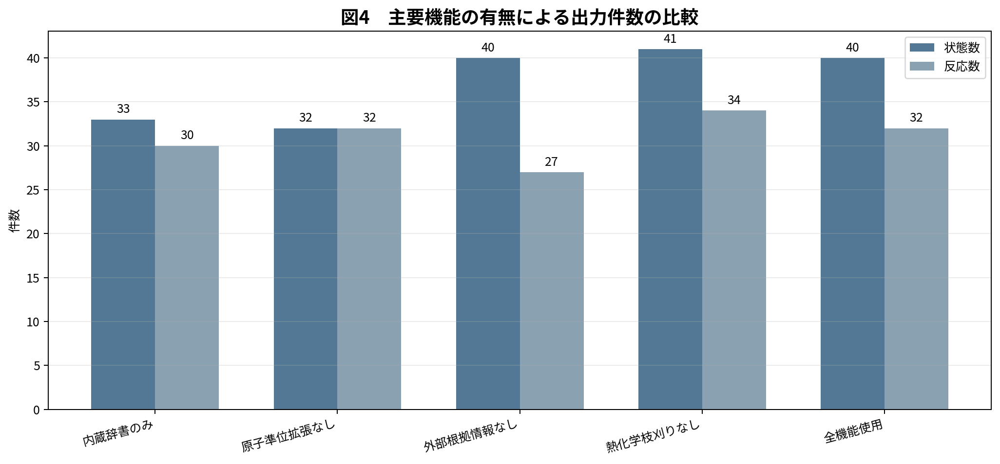
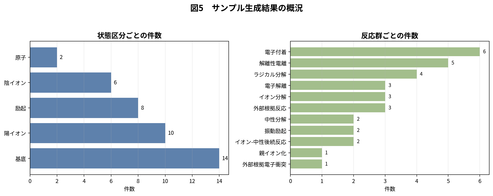
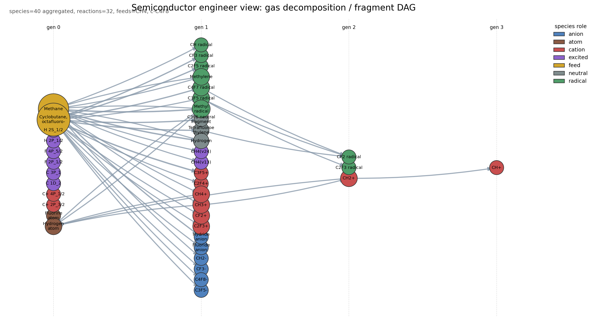
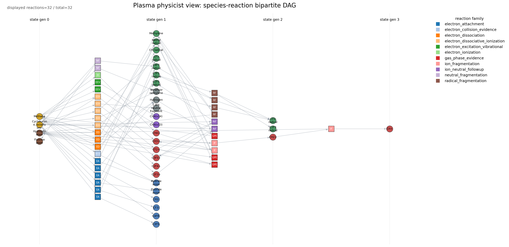
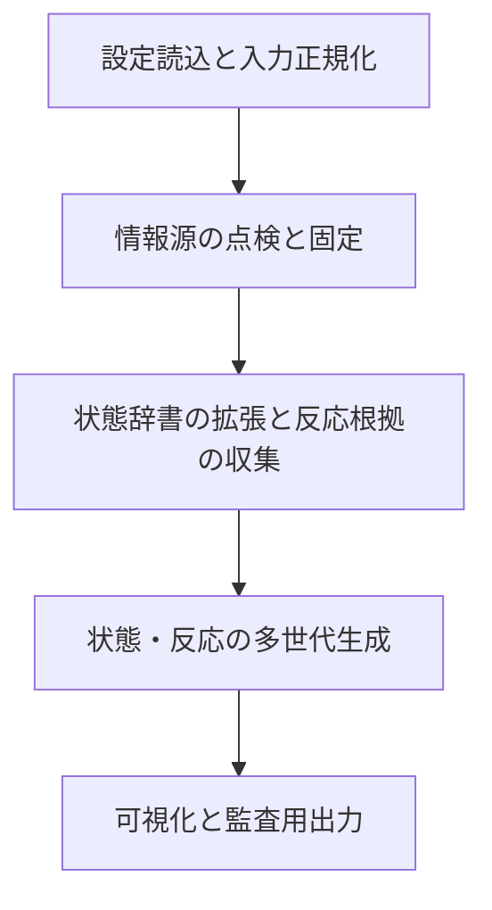
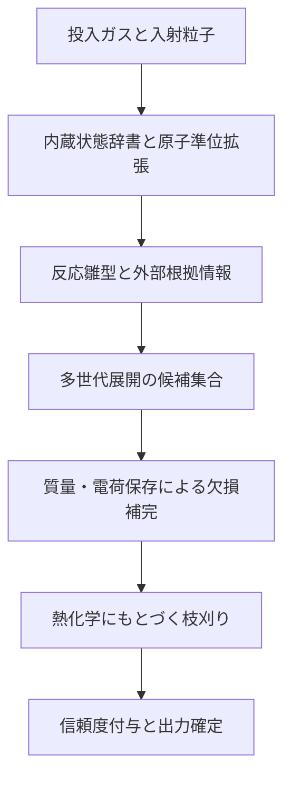
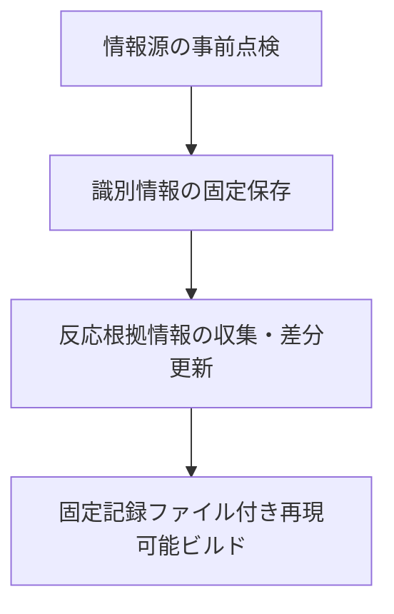

# 要旨

本報告は、半導体プロセス用低温プラズマを対象として、投入ガスから妥当な状態リストと反応式リストを自動生成する 「plasma-reaction-builder」第十版の設計と結果を整理したものである。本実装の目的は、反応係数を網羅的に取得することではなく、まず反応網の位相構造を、外部根拠情報・保存則・熱化学にもとづいて整合的に与えることにある。同梱例題では、メタンと八フッ化シクロブタンを投入ガスとし、電子を入射粒子とした条件で、最終的に 40 状態、32 反応が得られた。原子準位拡張により 8 状態が追加され、外部根拠情報により 4 本の反応雛型が補強され、熱化学にもとづく枝刈りにより 2 本の高吸熱反応が除去された。以上の結果から、本パッケージは、係数同定の前段として必要な状態空間と反応候補集合の整備、ならびにその監査可能化に有効であると結論づけられる。

# 1. 背景

半導体製造に用いられる低温プラズマでは、輸送方程式や反応速度方程式を解く以前に、そもそも何を状態として追跡し、どの反応式を候補として認めるかを定める必要がある。ところが実務では、断面積や速度係数の不足が先に問題視される一方で、その前提となる状態空間の定義と反応式集合の構築が後回しになりやすい。この順序の逆転は、特にフッ素系・炭化水素系・混合ガス系で深刻であり、同じ化学式でも構造の違いにより主生成物や後続反応が変わりうる。

本パッケージでは、この問題を「係数を持つ大規模反応機構の自動生成」としてではなく、「妥当な状態リストと反応式リストを、根拠とともに構築する問題」として定式化した。すなわち、投入ガス、入射粒子、既知の反応雛型、外部情報源、熱化学、保存則を組み合わせ、専門家が監査できる形で反応網の骨格を与えることを狙っている。

# 2. 課題

本実装が解くべき課題は、次の五点に整理できる。

| 課題 | 内容 |
| --- | --- |
| 投入ガスの同定 | 化学式だけでは異性体や表記ゆれを区別できず、後続の照合が不安定になる。 |
| 原子・原子イオン状態の欠落 | 分子断片だけでは、発光診断や段階的過程に必要な状態層が不足する。 |
| 反応候補の過不足 | 反応雛型だけに依存すると取りこぼしが生じ、逆に無制限に広げると反応網が肥大化する。 |
| 熱化学的に不利な経路の残存 | 高吸熱の分解反応が多世代展開の末端に残ると、反応式リストの妥当性が下がる。 |
| 更新運用と再現性の両立 | 外部情報源の更新を取り込みつつ、過去結果との比較可能性を保つ必要がある。 |

# 3. 目的

以上を踏まえ、本パッケージの目的は次のように限定される。第一に、投入ガスと入射粒子から、追跡に値する状態候補を生成すること。第二に、その状態群に対し、保存則と外部根拠情報に支えられた反応式候補を多世代にわたり生成すること。第三に、各状態と各反応に、根拠情報と信頼度を付与すること。第四に、生成結果と現在の辞書を、半導体工程、プラズマ物理、データ監査の三つの観点から可視的に読める形にすることである。

# 4. 課題に対する手法とアイデア

## 4.1 基本方針

設計の第一原理は、「まず存在根拠を整え、その後に係数同定へ進む」という順序である。この方針により、現段階では断面積や速度係数を実装の中心に置かず、代わりに種同定、原子準位拡張、反応根拠情報の統合、熱化学にもとづく枝刈りを主軸とした。

設計の第二原理は、「小さい中心部と明確な追加口」である。状態辞書、反応雛型、外部根拠情報、熱化学、可視化を別の層に分け、新しい情報源を追加する際には、原則として解析器一つと登録一行で済むようにした。

## 4.2 全体処理の流れ

内部処理は、投入情報の正規化、状態辞書の拡張、反応雛型の準備、外部根拠情報にもとづく雛型追加、世代展開、欠損生成物補完、熱化学枝刈り、信頼度付与の順に進む。この順序を採ることで、生成された反応式がどの段階で採用されたか、どの情報源に支えられているかを追跡できる。

## 4.3 利用する外部情報源と役割分担

| 情報源 | 役割 | 主な取得内容 | 本パッケージでの位置づけ |
| --- | --- | --- | --- |
| 化学物質情報の公開基盤 | 投入ガスの同定と別名整理 | 名称、化学式、構造記述、同義語 | 投入ガスを正規化し、内部辞書の鍵を安定化する。 |
| 米国国立標準技術研究所の原子スペクトルデータベース | 原子・原子イオン準位の拡張 | 原子準位、電離段、電離エネルギー | 原子状態を明示的に追跡できるようにする。 |
| 能動熱化学表 | 熱化学にもとづく枝刈り | 生成熱、反応熱 | 高吸熱反応を抑制し、反応網の過大化を防ぐ。 |
| 米国国立標準技術研究所の化学反応速度データベース | 気相熱反応の存在根拠 | 反応物・生成物・文献情報 | 熱反応として既知の反応を補助的に導入する。 |
| Quantemol の反応データベース | 検証済みプラズマ反応の根拠 | 反応集合、化学系識別子 | プラズマ分野に特化した存在根拠を補強する。 |
| 原子分子データ仮想センター標準 | 標準化された状態・過程情報の取り込み | 状態、過程、文献、共通形式 | 電子付着など個別過程の存在確認に用いる。 |
| 天体化学用反応網（UMIST, KIDA） | 補助的な反応候補の供給 | 反応網、品質指標、配布ファイル | 主証拠ではなく補助的な候補源として用いる。 |

## 4.4 状態生成

状態生成の起点は内蔵状態辞書であり、現行版には 36 種が登録されている。ここには投入ガス、主要断片、正負イオン、代表的励起種が含まれる。さらに原子スペクトルデータベースからの起動時拡張により、例題では 8 種の原子・原子イオン状態が追加された。これにより、分子断片中心の辞書に、原子準位というプラズマ物理上重要な層が加わる。

外部情報源や質量保存補完の過程で、辞書未登録の種が必要となる場合がある。その際は、反応式中の表記から最小限の状態を合成する。ただし、この経路で作られた状態には低い信頼度を与え、診断出力にも記録する。未知種を黙って辞書に吸収しない点が、本実装の重要な安全策である。

## 4.5 反応生成

反応雛型は、内蔵反応辞書と外部根拠情報の二系統から供給される。内蔵反応辞書には、メタン系 16 本、八フッ化シクロブタン系 15 本、合計 31 本の雛型がある。外部根拠情報からは、例題で 4 本の雛型が追加された。外部由来の反応をいきなり最終結果へ入れるのではなく、まず雛型候補として取り込み、その後に保存則と熱化学による検査を通す構成である。

世代展開では、前世代までに利用可能となった状態だけを反応物として用い、しかも今回の前線に属する状態を少なくとも一つ含む反応だけを適用する。これにより、全組合せ探索による反応数爆発を避けつつ、一次、二次、三次の生成過程を自然にたどることができる。

## 4.6 質量・電荷保存による欠損生成物の補完

反応式に主要生成物のみが書かれており相方中性種が未記入の場合には、質量・電荷保存から不足生成物を補う。例題では 2 本のイオン-中性後続反応に対して、対生成物が厳密保存にもとづき補完された。この処理は、反応位相を確定するという本パッケージの目的にとって不可欠である。

## 4.7 熱化学にもとづく枝刈り

熱化学枝刈りでは、各状態に付与された生成熱から反応熱を計算し、強い吸熱を示す反応のうち、外部根拠が薄いものを除去する。例題では 2 本の高吸熱ラジカル分解反応が除去された。この操作により、世代展開の深さを保ちながら、末端部での不自然な過分解を抑制している。

ここで重要なのは、枝刈りが熱化学だけで機械的に決まるわけではない点である。既知の反応データベースに同一反応が存在する場合には、熱的に不利でも安易には捨てない。つまり、本実装は「保存則だけの生成器」でも「熱化学だけの選別器」でもなく、複数根拠の重ね合わせで採否を決める。

## 4.8 信頼度付与

各反応と各状態には信頼度が付与される。信頼度は、内蔵雛型の基礎点、外部根拠情報の強さ、質量・電荷保存の成立、しきい値条件、熱化学、世代の深さを合成して計算する。単一の点数だけを出すのではなく、どの要素が点数に効いたかを分解して持たせることで、専門家が後から判断を見直しやすくしている。

## 4.9 自動収集・更新と再現性の確保

外部情報源の利用では、毎回の生取得を避け、点検・固定・収集・構築を分けている。投入ガスの同定結果は固定保存し、反応根拠情報は収集時にまとめて正規化し、構築時には固定済みの情報だけを読む。さらに、固定記録ファイルに設定の要約、情報源の状態、収集件数を残すことで、いつ、どの情報源を使って結果が得られたかを再現できる。

## 4.10 可視化

可視化部は、生成済みの状態リストと反応式リストを、異なる読者に合わせて表現し分ける。例題では 19 個の可視化成果物が出力される。半導体工程向けには、投入ガスから断片・イオン・ラジカルへ至る世代別の工程俯瞰図を与える。プラズマ物理向けには、種ノードと反応ノードを分けた二部グラフにより、反応群と種群の結合構造を明示する。データ監査向けには、辞書・生成結果・出典分布を一覧表として出力する。

可視化機能を別の層に切り出したことにより、後から新しい図を追加しても、状態生成部や反応生成部を触る必要がない。第三者が図を追加する場合は、可視化用の登録関数を一つ増やすだけでよい。

# 5. コード構成と工夫

実装は、設定読込、辞書、正規化、情報源解析器、構築本体、可視化の六層に整理している。重要なのは、各情報源を個別の解析器として分離し、構築本体が「どの情報源であったか」を知らなくてもよい形にした点である。これにより、将来の情報源追加が局所化される。

| 主なファイル | 役割 |
| --- | --- |
| config.py | 設定ファイルの読込と構造化。投入ガス、入射粒子、制約条件、情報源設定を保持する。 |
| catalog.py | 内蔵状態辞書と反応雛型辞書の読込、外部辞書との統合。 |
| normalization.py | 表記ゆれの正規化。外部情報源の種名を内部の鍵へ寄せる。 |
| adapters/pubchem_identity.py | 投入ガスの同定結果を読み込み、名称・構造・同義語を状態へ付与する。 |
| adapters/nist_asd.py | 原子スペクトルデータベースの出力を読み込み、原子・原子イオン状態を生成する。 |
| adapters/atct.py | 生成熱を状態へ付与し、反応熱計算に供する。 |
| adapters/reaction_evidence.py | 反応根拠情報の読込と統合。各情報源解析器を登録し、共通形式へ正規化する。 |
| builder.py | 状態生成、反応生成、保存則補完、熱化学枝刈り、信頼度付与を担う中心部。 |
| visualization/* | 工程俯瞰図、二部グラフ、辞書一覧図などの出力。 |

新しい情報源を追加する場合、原則として必要なのは三点である。第一に、解析器を一つ追加すること。第二に、反応根拠情報の登録表へ一行追加すること。第三に、当該情報源の重み付けを設定することである。中心部の状態生成や反応展開の処理には触れない。この設計により、機能追加が「全面改修」ではなく「局所追加」で済む。

# 6. 手法による効果

## 6.1 機能の有無による比較

機能の有効性は、同一例題に対して機能を順に外した比較により評価した。比較対象は、内蔵辞書のみ、原子準位拡張なし、外部根拠情報なし、熱化学枝刈りなし、全機能使用の五条件である。状態数・反応数の比較を図4に、要点を表4に示す。

| 条件 | 状態数 | 反応数 | 読み取り |
| --- | --- | --- | --- |
| 内蔵辞書のみ | 33 | 30 | 初期辞書だけでも基本的な網は得られるが、原子準位と外部根拠が不足する。 |
| 原子準位拡張なし | 32 | 32 | 原子・原子イオンの状態層が薄くなり、診断や段階的過程の記述力が落ちる。 |
| 外部根拠情報なし | 40 | 27 | 反応数が減り、外部根拠が無い高吸熱分解は維持されにくい。 |
| 熱化学枝刈りなし | 41 | 34 | 熱的に不利な分解段が残り、反応網が過大になる。 |
| 全機能使用 | 40 | 32 | 状態数と反応数の過不足が抑えられ、根拠付きの網が得られる。 |

原子準位拡張を外すと状態数は八件減少し、原子・原子イオンの層が失われる。一方、外部根拠情報を外すと反応数は五件減少し、既知の再結合・戻り反応や電子付着の存在根拠が弱くなる。熱化学枝刈りを外すと反応数は増えるが、その増加分は高吸熱分解の残留であり、物理的妥当性を必ずしも意味しない。この結果は、本パッケージが単なる件数拡大ではなく、状態空間の補強と反応網の節度ある整理を同時に行っていることを示す。

## 6.2 現行版の生成結果の概況

現行版の同梱例題では、投入ガス二種、入射粒子一種、最大世代三という条件で、四十状態、三十二反応が得られた。状態の内訳は、基底状態十四、陽イオン十、励起状態八、陰イオン六、原子二である。反応群の内訳では、電子付着、解離性電離、ラジカル分解、電子解離が主であり、これに気相反応根拠由来の反応が加わる。

熱化学値を持つ状態は 6 件、反応熱が付与された反応は 7 件、化学物質情報の同定が付与された投入ガスは 2 件であった。この分布は、本パッケージが全ての状態へ一様に詳細情報を付ける設計ではなく、投入ガス、原子状態、主要分解系列に情報を集中させる設計であることを示している。

# 7. 結果の妥当性と考察

結果の妥当性は、少なくとも四つの観点から確認できる。第一に、全ての最終反応は質量・電荷保存を満たす。第二に、高吸熱で外部根拠の薄い分解段は除去されている。第三に、電子付着や気相反応については外部情報源に存在根拠が付与されている。第四に、原子準位層が加えられているため、工程俯瞰だけでなく物理診断の入口としても読める。

ただし、本実装は「妥当な候補集合」を構築する段階のものであり、係数同定や全反応経路の完備性を保証するものではない。また、分子の高次励起や複雑な構造異性体については、現状では内蔵辞書と外部情報源の到達範囲に依存する。したがって、本パッケージは、反応速度論計算の最終形ではなく、その前段における構造化・監査可能化の道具として理解すべきである。

さらに、外部情報源の重み付けには分野依存性がある。プラズマ専用の検証済み反応集合と、天体化学由来の反応網とを同列に扱わないよう設計したが、どの重みが最適かは対象プロセスにより変わりうる。この点は、本パッケージが情報源ごとの強さ設定を独立ファイルに切り出している理由でもある。

## 7.1 例題から確認できる具体的事実

| 項目 | 値 |
| --- | --- |
| 投入ガス数 | 2 |
| 生成状態数 | 40 |
| 生成反応数 | 32 |
| 内蔵状態辞書の件数 | 36 |
| 内蔵反応雛型の件数 | 31 |
| 原子準位拡張で追加された状態数 | 8 |
| 外部根拠情報から追加された反応雛型数 | 4 |
| 質量・電荷保存で補完された反応数 | 2 |
| 熱化学枝刈りで除去された反応数 | 2 |
| 可視化成果物数 | 19 |

## 7.2 生成図の例

以下の図は、本パッケージが実際に出力する工程俯瞰図と二部グラフの例である。図中の英語表記はコード出力そのままであるが、監査対象としての可視化例を示すために掲載する。

# 8. 将来拡張性

| 拡張項目 | 内容 |
| --- | --- |
| 表面反応の導入 | 現在は気相中心である。表面吸着、脱離、エッチング反応を別層として追加できる。 |
| 構造認識の強化 | 異性体識別や環開裂系列を、構造記述に基づいてより厳密に扱える。 |
| 係数層の追加 | 将来的には、必要な反応に限って断面積や速度係数を後付けすることができる。 |
| 対象ガス系の拡張 | 酸素系、窒素系、塩素系、シラン系などへ、反応雛型と辞書を追加できる。 |
| 可視化の拡張 | 工程向け、物理向け、監査向けに加え、比較用や差分用の図を追加できる。 |

# 9. まとめ

以上より、本パッケージは、半導体プラズマに対する状態リストと反応式リストの生成において、係数取得よりも前に解くべき問題を整理し、そのための最小限かつ拡張可能な実装を与えたと言える。原子準位拡張、外部根拠情報の統合、熱化学にもとづく枝刈り、可視化の分離により、反応網は過小にも過大にもなりにくく、しかも第三者が手を入れやすい。研究用の反応網作成、装置プロセス検討時の初期仮説形成、反応データ整備の前処理として、本実装は十分に有用である。

# 参考文献

[1] PubChem PUG-REST, PubChem, 公式文書。化学物質情報に対する公開接続仕様。

[2] NIST Chemistry WebBook, SRD 69, 米国国立標準技術研究所。熱化学、反応熱、イオン熱化学、振動・電子準位などを収録。

[3] NIST Atomic Spectra Database, SRD 78, 米国国立標準技術研究所。原子・原子イオンの準位、線、電離エネルギーを収録。

[4] Active Thermochemical Tables, Argonne National Laboratory. 熱化学ネットワークにもとづく整合熱化学値。

[5] NIST Chemical Kinetics Database, SRD 17, 米国国立標準技術研究所。気相熱反応の反応記録と文献情報。

[6] Quantemol Database API, Quantemol. 検証済みプラズマ反応集合の配信仕様。

[7] VAMDC-TAP および VAMDC-XSAMS, VAMDC standards documentation. 状態・過程・文献を共通形式で交換するための標準。

[8] The UMIST Database for Astrochemistry, Rate22. 反応網および配布ファイル仕様。

[9] KIDA Help / Networks. 品質指標、推定値区分、配布反応網の説明。

# 付録A　編集用ワークフロー記述（Mermaid）

以下は本文の図1〜図3と同内容の編集用記述である。第三者が流れを編集する際には、この記述を出発点にすればよい。

